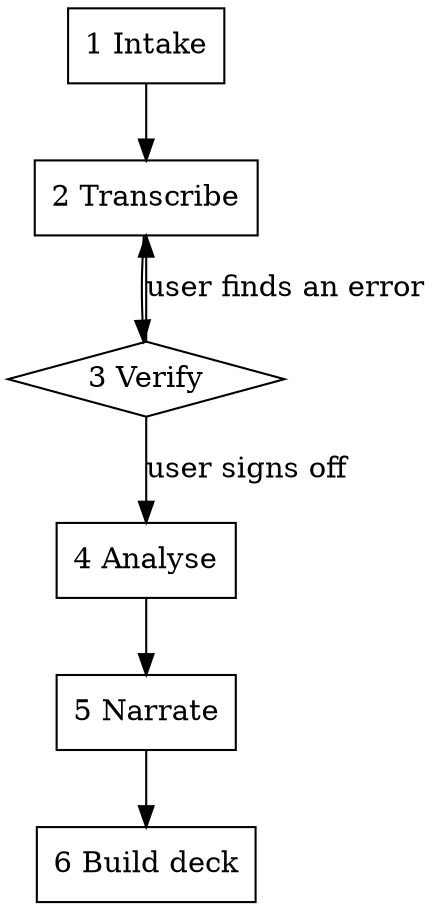

# TCA Review

## Overview

Turn transaction cost analysis output into an execution review a client can act on.

Two failures this exists to prevent:

1. **A number misread off a photo reaching a client slide.** The numbers arrive as
   images, so transcription is the weakest link in the chain and is gated.
2. **An algo judged against a benchmark it was never trying to hit.** Scoring a
   TWAP on VWAP, or a close algo on its distance from the close, produces
   confident nonsense.

**Core principle: every algo is judged against the job it was given, and no number
reaches a slide until it has been checked against its source image.**

## Who reads the output

A client who trades algos every day and does **not** speak TCA, presented to them
by a sales trader who must defend every number on the call without a quant.

The deck is written for that reader. The technical backup lives in the speaker
notes. This is enforced mechanically by `scripts/check_readability.py`, which
fails the build - it is not a style preference. See
`references/plain-language.md`.

## Workflow

Six phases, in order. Phase 3 is a hard gate.



### 1. Intake

Create the review folder, then convert the images.

```bash
mkdir -p reviews/<client>-<period>/{images,data,charts}
# user drops .HEIC files into reviews/<client>-<period>/images/
python .claude/skills/tca-review/scripts/intake.py \
  --in reviews/<client>-<period>/images \
  --out reviews/<client>-<period>/images/png --tile
```

`--tile` also writes quadrant crops of dense images so small type is legible.
Read `inventory.csv`, then read every PNG. Details: `references/image-intake.md`.

### 2. Transcribe

Write what you read into the CSVs in `data/`, one row per number, each tagged
with the image it came from. The schema is fixed: `assets/data-schema.md`.

Transcribe only what is in the image. If a cell is unreadable, write `NA` and
record it in `sources.csv` - never infer a digit from the surrounding pattern.

### 3. Verify - GATE

**Do not start phase 4 until the user has signed off.**

```bash
python .claude/skills/tca-review/scripts/verify.py --review reviews/<client>-<period>
```

That runs the arithmetic checks. Then do the human part:

- Re-read every source image **fresh** against the transcription. Do not read
  the CSV first - read the image, then compare.
- Write `verification.md`: every check with pass/fail, every `NA`, every number
  whose source you are less than certain of, named individually.
- Show it to the user and ask for sign-off in one message. Wait.
- On sign-off set `"verified": true` in `meta.json`. `build_deck.py` refuses to
  run without it.

### 4. Analyse

Per strategy, against that strategy's own benchmark. Never rank two families on
one number. Always show fill rate beside a passive or opportunistic result.

- `references/strategy-playbooks.md` - one playbook per algo family
- `references/tca-fundamentals.md` - benchmarks, decomposition, significance
- `references/moc-close-algos.md` - closing and opening auction specifics

Write `findings.md`: each finding as observation, size of it in money or bps,
confidence, and what to do about it. State what the data cannot support.

### 5. Narrate

Rewrite each finding for the reader. Three beats, in order: what happened, what
it cost or saved, what to do. Apply `references/plain-language.md`.

It has to read as though a trader on the desk wrote it: varied rhythm, a plain
opinion where there is one, specifics rather than generalities. A deck that reads
as generated loses the client's trust in the numbers as well as the prose.

Build `deck.json` from `references/deck-blueprint.md`.

### 6. Build

```bash
python .claude/skills/tca-review/scripts/build_deck.py --review reviews/<client>-<period>
```

Renders the charts, runs the readability check, writes the `.pptx`. A readability
violation fails the build - fix the wording, do not disable the check.

## Quick reference

| File | What it is for |
|---|---|
| `references/tca-fundamentals.md` | Benchmarks, what each answers, cost decomposition, significance, pitfalls |
| `references/strategy-playbooks.md` | Per-algo: the job, the benchmark, what good looks like, the classic wrong call |
| `references/moc-close-algos.md` | Auction algos: why distance from the close says nothing, capacity, miss taxonomy |
| `references/plain-language.md` | The register, the word swaps, the banned terms |
| `references/deck-blueprint.md` | Slide-by-slide structure |
| `references/image-intake.md` | Reading numbers off photos without inventing them |
| `assets/data-schema.md` | The CSV contract |
| `assets/deck-manifest.md` | The `deck.json` contract |

## Red flags - stop

| You are about to | Instead |
|---|---|
| Rank VWAP against MOC on one benchmark | Score each against its own target; compare like-for-like only |
| Call an algo good on slippage alone | Show fill rate next to it - unfilled shares are a real cost |
| Judge a close algo on its distance from the close | Measure how much of it reached the auction |
| Use full-session VWAP on a 40-minute order | Use PVWAP over the window the order actually traded |
| Call a difference real without n | State the sample size; under n=30 say it is indicative, not proven |
| Fill a gap in the transcription from context | Write `NA` and name it in `verification.md` |
| Build the deck before sign-off | The build refuses. Get the sign-off. |
| Loosen the readability check to fit a sentence | Rewrite the sentence |
| Write a slide you would not say aloud on the call | Say it the way you would say it |
| Hedge every conclusion | Commit to a view, or leave the slide out |
